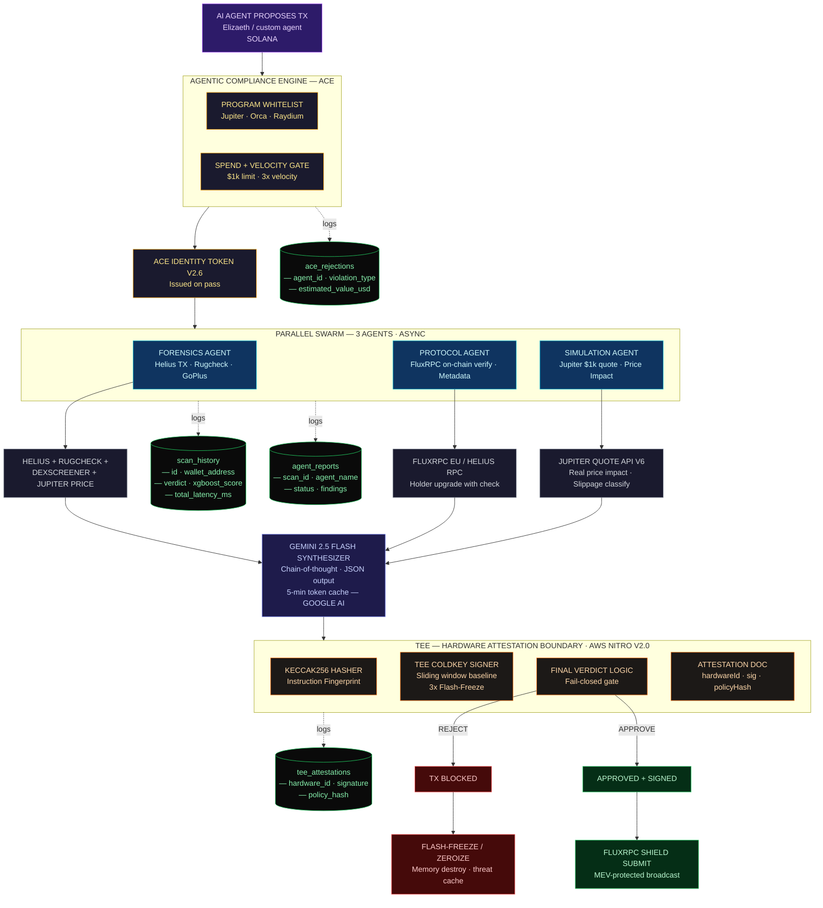
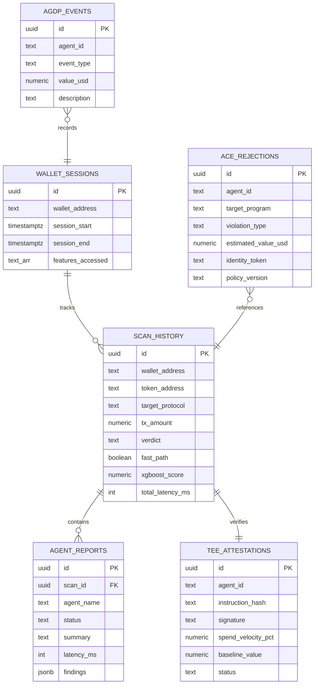

<p align="center">
  
</p>

# Veritas Frontier v2.6 — Sentinel Enclave
### Hardware-Secured, Multi-Agent Forensics for AI Agent Wallets on Solana


Veritas Frontier is a high-fidelity security platform designed to protect AI agents on Solana. It combines **TEE (Trusted Execution Environment)** isolation with **LangGraph Multi-Agent Swarms** to provide a Defense-in-Depth architecture for agentic transactions.

---

## The Problem

AI agents are now autonomous economic actors on Solana. They hold wallets, sign transactions, and move real money — 24/7, with no human in the loop.

**But there is zero security infrastructure built for them.**

- A single compromised LLM prompt can drain an agent's entire wallet in one transaction.
- Agents interact with unverified tokens and protocols with no way to assess risk before signing.
- There is no compliance layer — no spend limits, no program whitelists, no audit trail.
- When an agent gets exploited, there's no forensic record of *what happened* or *why*.

Traditional wallet security (multisig, hardware wallets) was designed for humans. It doesn't work for software agents that need to transact autonomously at machine speed.

> **The gap:** Billions of dollars are flowing into agentic infrastructure (ElizaOS, Virtuals, Sendai), but nobody is building the security layer underneath it. Every agent protocol is one exploit away from a catastrophic loss event.

## Our Solution

Veritas Frontier is a **defense-in-depth security pipeline** that sits between an AI agent and the Solana blockchain. Every transaction an agent proposes must pass through three independent security layers before it ever touches the chain:

**Layer 1 — ACE (Agent Compliance Engine)**
Protocol-level gating that enforces hard rules before any intelligence runs. Program whitelists (only interact with Jupiter, Orca, Raydium), spend limits ($1K per TX), and velocity gates (3x baseline = freeze). If a transaction violates policy, it's rejected instantly — no LLM needed.

**Layer 2 — Multi-Agent Investigation Swarm (LangGraph)**
Three specialized agents run in parallel to analyze the transaction:
- *Forensics Agent* — pulls token history from Helius, runs rugcheck, checks holder concentration
- *Protocol Agent* — verifies on-chain program metadata via FluxRPC
- *Simulation Agent* — simulates the swap on Jupiter to measure real price impact and slippage

A Gemini 2.5 Flash synthesizer merges all findings into a structured risk verdict with chain-of-thought reasoning.

**Layer 3 — TEE Hardware Attestation (AWS Nitro)**
The final verdict is signed inside a Trusted Execution Environment using an isolated Ed25519 coldkey. The TEE produces a cryptographic attestation document (instruction hash + signature + policy hash) that proves the transaction was analyzed and approved by an untampered security enclave. If the risk is too high, the TEE triggers a **Flash-Freeze** — zeroizing the signing key and halting all agent activity.

**The result:** Every approved transaction has a full forensic audit trail — who proposed it, what the swarm found, what the TEE signed, and why. Every blocked transaction has a rejection log with the exact violation. Nothing goes on-chain without passing all three layers.

## Why Now

| Signal | What it means |
|:---|:---|
| **$500M+** flowing into agentic crypto protocols in 2025-2026 | The market for agents is exploding, but security is an afterthought |
| ElizaOS, Virtuals, Sendai all launching agent wallets on Solana | Every one of these needs a security layer — they don't have one |
| Solana processing 50M+ daily transactions | The attack surface is massive and growing |
| No existing "firewall for AI agents" product exists | **First-mover advantage in a category that doesn't exist yet** |

## Business Model

| Revenue Stream | How it works |
|:---|:---|
| **Per-scan API pricing** | Agent protocols pay per transaction scanned (like an API gateway) |
| **Enterprise SLA tiers** | Premium latency, dedicated TEE instances, custom policy rules |
| **Protocol integrations** | White-label Veritas as the security layer inside agent frameworks |
| **Audit-as-a-Service** | On-demand forensic investigations for post-incident analysis |

---

## System Architecture

The full transaction pipeline — from proposal to on-chain broadcast — is shown below.



### External API Dependencies

| Service | Role | Endpoint |
| :--- | :--- | :--- |
| **Helius API** | Token metadata · TX history | `api.helius.xyz` |
| **Rugcheck.xyz** | Contract audit scores | `rugcheck.xyz` |
| **DexScreener** | Liquidity + price feeds | `api.dexscreener.com` |
| **Google Gemini 2.5 Flash** | Chain-of-thought synthesis | `generativelanguage.googleapis.com` |
| **Jupiter V6 API** | Quote · Swap · Price Impact | `quote-api.jup.ag` |
| **FluxRPC (EU)** | MEV-shielded private RPC | `fluxrpc.com` |

---

## Database ERD (Supabase)



---

## Investigation Swarm (LangGraph)
A multi-agent pipeline that automates deep-dive research into any entity or token.
- **Hunter Agent** — Aggressive web crawler (Tavily) that finds sources and extracts claims.
- **Skeptic Agent** — Adversarial "Devil's Advocate" that cross-examines findings to detect conflicts.
- **Human Handoff** — A circuit breaker that pauses execution when the swarm hits high-severity ambiguity.
- **Synthesizer** — DeepSeek-R1 / Gemini 2.5 Flash LLM that generates premium intelligence reports.

## TEE Enclave Layer (Sentinel)
The hardware root-of-trust for agentic transactions.
- **Sentinel Brain** — A risk-scoring engine that classifies tokens as `SAFE`, `SUSPICIOUS`, or `MALICIOUS` based on Helius and Jupiter data.
- **TEE Signer** — AWS Nitro-simulated enclave that signs every scan result with an isolated Ed25519 keypair.
- **ACE Guard** — Agent Compliance Engine that enforces protocol-level gating (whitelist, spend limits).
- **FluxRPC Shield** — A private RPC relay that protects against MEV and DDoS attacks.

---

## Deployment: Railway & Supabase
Veritas Frontier is optimized for high-uptime, persistent agentic workflows.

1.  **Monorepo Support** — Handles both the Next.js frontend and the Node.js engine seamlessly.
2.  **Persistent SSE** — Unlike Vercel, Railway keeps containers alive for long-running LangGraph investigations.
3.  **Encrypted Vaults** — Secure management of HELIUS, TAVILY, and GEMINI keys.

---

## API Keys Reference
| Key Name | Purpose | Required |
| :--- | :--- | :--- |
| `GEMINI_API_KEY` | Intelligence synthesis and threat reports | Yes |
| `TAVILY_API_KEY` | Web research and forensic crawling | Yes |
| `HELIUS_API_KEY` | Solana token metadata and history | Yes |
| `FLUXRPC_API_KEY` | MEV-shielded private RPC relay | Yes |
| `JUPITER_API_KEY` | Token liquidity and price impact checks | Yes |
| `SUPABASE_URL` | Log persistence and audit trails | Optional |

---

## Installation
```bash
# Install dependencies
npm install

# Run development server
npm run dev
```

---
**Veritas Frontier** — *Securing the Agentic Economy on Solana.*