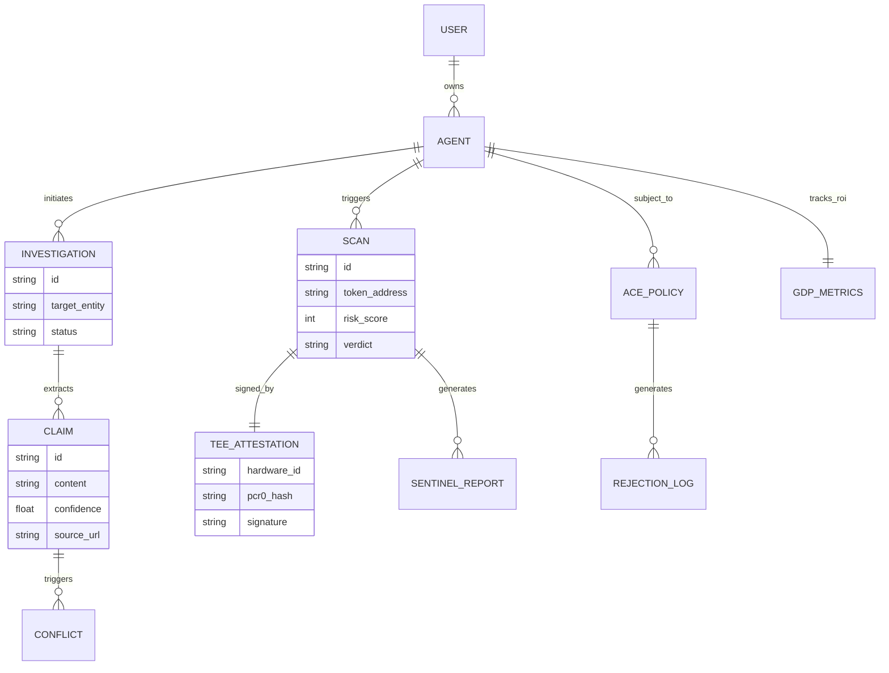

# Veritas Frontier v2.6 — Sentinel Enclave
### Hardware-Secured, Multi-Agent Forensics for AI Agent Wallets on Solana

Veritas Frontier is a high-fidelity security platform designed to protect AI agents on Solana. It combines **TEE (Trusted Execution Environment)** isolation with **LangGraph Multi-Agent Swarms** to provide a "Defense-in-Depth" architecture for agentic transactions.

---

## 🌀 System Architecture & ERD

The following diagram illustrates the relationship between the Multi-Agent Investigation layer, the TEE Security layer, and the On-Chain Governance (ACE).



---

## 🕵️ Investigation Swarm (LangGraph)
A multi-agent pipeline that automates deep-dive research into any entity or token.
- **Hunter Agent**: Aggressive web crawler (Tavily) that finds sources and extracts claims.
- **Skeptic Agent**: Adversarial "Devil's Advocate" that cross-examines findings to detect conflicts.
- **Human Handoff**: A circuit breaker that pauses execution when the swarm hits high-severity ambiguity.
- **Synthesizer**: Gemini 2.5 Flash LLM that generates premium intelligence reports.

## 🛡️ TEE Enclave Layer (Sentinel)
The hardware root-of-trust for agentic transactions.
- **Sentinel Brain**: A risk-scoring engine that classifies tokens as SAFE, SUSPICIOUS, or MALICIOUS based on Helius & Jupiter data.
- **TEE Signer**: AWS Nitro-simulated enclave that signs every scan result with an isolated Ed25519 keypair.
- **ACE Guard**: Agent Compliance Engine that enforces protocol-level gating (whitelist, spend limits).
- **FluxRPC Shield**: A private RPC relay that protects against MEV and DDoS attacks.

---

## 🚀 Deployment Suggestion: Railway
While Vercel is great for frontends, **Railway** is better for monorepos that include background agents and SSE (Server-Sent Events) streams.

1.  **Monorepo Support**: Handles both the Next.js frontend and the Node.js engine seamlessly.
2.  **Persistent SSE**: Unlike Vercel's serverless functions which have a 10s-30s timeout, Railway's containers stay alive, allowing the LangGraph swarm to run long investigations without being killed.
3.  **Environment Variables**: Easy management of `HELIUS`, `TAVILY`, and `GEMINI` keys.

---

## 🔑 API Keys Reference
| Key Name | Purpose | Required |
| :--- | :--- | :--- |
| `GEMINI_API_KEY` | Intelligence synthesis & threat reports | ✅ Critical |
| `TAVILY_API_KEY` | Web research & forensic crawling | ✅ Critical |
| `HELIUS_API_KEY` | Solana token metadata & history | ✅ Critical |
| `FLUXRPC_API_KEY` | MEV-shielded private RPC relay | ✅ Critical |
| `JUPITER_API_KEY` | Token liquidity & price impact checks | ✅ Critical |
| `SUPABASE_URL` | Log persistence & audit trails | ⚠️ Optional |

---

## 🛠️ Installation
```bash
# Install dependencies
npm install

# Run development server
npm run dev
```

*Veritas Frontier — Secure your DeFi agents. We evaluate it.*