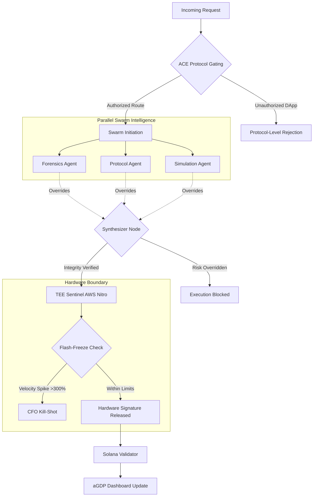

# Veritas: The Brex for AI Bots
**Hardware-Enforced Protocol Security & Agentic Yield Management on Solana.**

Veritas is no longer just a security tool—it's a **Business Intelligence Layer** for the 2026 Agent Economy. By migrating from legacy MPC models to **Confidential Computing (TEE)** and **Access Control Execution (ACE)**, Veritas provides sub-second deterministic finality while tracking the actual economic value (aGDP) your Swarm generates.

---

## 🏛️ Architecture: The Frontier v2.6 Pipeline

The system ensures zero-trust security for agentic wallets using hardware attestation and the ACE protocol.



---

## 🛡️ Core Components (Frontier v2.6)

### 1. TEE Sentinel (`tee_signer.ts`)
**Why TEE? The Evolution from MPC.**  
By April 2026, autonomous velocity requires sub-400ms finality. Traditional Multi-Party Computation (MPC) relies on multi-round network communication, which introduces unacceptable latency. The **TEE Sentinel** shifts the paradigm from "Trust the Math" to "Trust the Hardware."
- The `Coldkey` is isolated inside an AWS Nitro or Intel TDX Enclave.
- Deterministic Keccak256 hashing is used for instruction approval.
- A hardware-level **"CFO Kill-Shot"** (Flash-Freeze) automatically zeroizes access if a 300% spend spike is detected.

### 2. Protocol Gating (`ace_guard.ts`)
Implements the Access Control Execution (ACE) protocol.
- Only interactions with deeply verified, vetted programs (Jupiter, Orca, Raydium) receive an `ACE_IDENTITY_TOKEN`.
- **Soft-ACE Swarm Override Validation (Defense in Depth):** Even if an instruction routes through an authorized protocol (like Jupiter), the Swarm's Forensics Agent actively scans the interaction. If a whitelisted program routes to an unverified rug-pull token flagged on SolanaFM, the Swarm will natively overrule the ACE whitelist and block the transaction.

### 3. Agentic GDP (`agdp_tracker.ts`)
*Veritas is a Yield-Protection Layer.*
- Measures autonomous productivity in real-time.
- Tracks `Agentic GDP`, `API Execution Cost`, and overall `Protected Yield (ROI)`.
- Automates and negotiates micro-payments (HTTP x402) for API/Swarm operations utilizing the Colosseum Codex verification.

---

## 🚀 The Brex Dashboard

This repo features a Next.js 14 frontend highlighting:
- Live pulse of the active AWS Nitro Node.
- Raw Keccak256 verification of the instruction hashes.
- Hardcoded interactive Demo Presets:
  - **High-Velocity Attack**: Shows the "CFO Kill-Shot" protecting $150,000 of funds in real-time.
  - **Jupiter via Rug Token**: Evaluates the Soft-ACE Defense in Depth override.
  - **Untrusted DEX**: Triggers instant protocol rejection via ACE validation.

---

## 🛠️ Getting Started

### Prerequisites
- Node.js 20+
- `.env` configured with your Virtuals API (for aGDP mocking) and Solana RPC.

### Installation

1.  **Clone the Repository**:
    ```bash
    git clone https://github.com/atharv20s/Veritas-Collesium.git
    cd Veritas-Collesium
    ```

2.  **Install Dependencies**:
    ```bash
    npm install
    cd frontend && npm install
    ```

3.  **Run Development Environment**:
    ```bash
    cd frontend && npm run dev
    ```

---

## ⚖️ License

This codebase is licensed under the MIT License. Built for the Solana Colosseum Hackathon (April 2026).